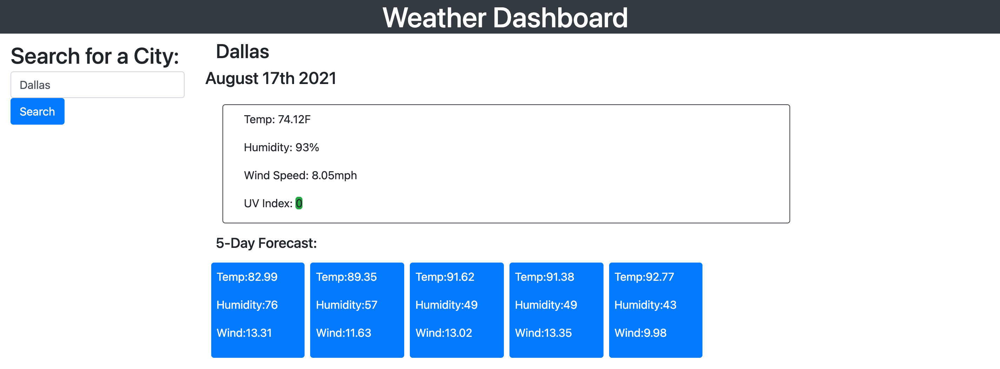

# Weather-Dashboard
The weather dasboard app is designed for travelers to check for weather outlook for multiple citites so they can plan their trip accordingly. The weather dashboard runs in the browser and features dynamically updated HTML. 

# URL

Deployed link: https://tpham912.github.io/Weather-Dashboard/

GitHub repo link: https://github.com/tpham912/Weather-Dashboard

